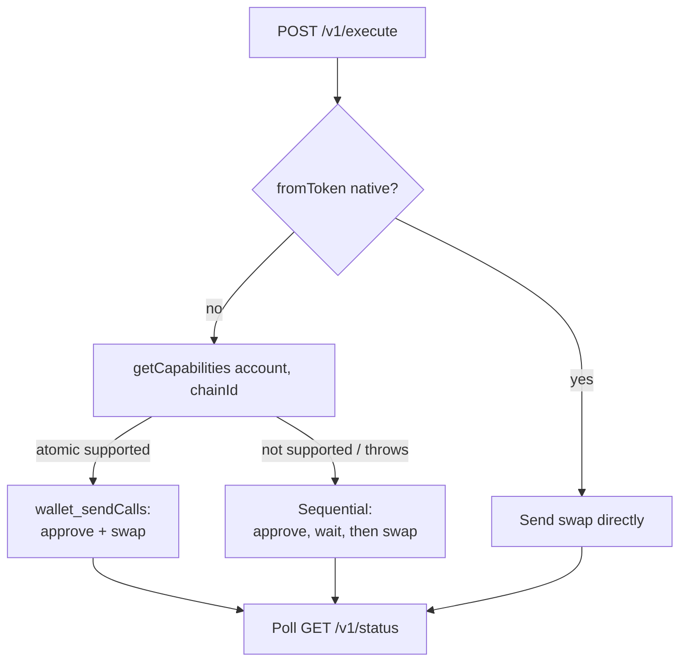

Every ERC20 swap classically takes **two wallet interactions**: first `approve` the
spender, then send the swap. With **EIP-5792** (`wallet_sendCalls`) — executed
via an **EIP-7702** delegation for plain EOAs — supporting wallets run both calls
as **one atomic batch in a single signature**. Fewer clicks, no stuck-approval
state, and the approval can't be left dangling or front-run.

Hypermid's [hosted widget](/guides/widget-integration) already does this
automatically. This guide is for partners building their **own** execution flow
on top of [`POST /v1/execute`](/api-reference/execute) who want the same one-tap
experience.

<Note>
  This is a **progressive enhancement**. Atomic batching is per `(wallet, chain)`
  and not yet universal — you **must** detect support at runtime and fall back to
  the sequential approve-then-swap path when it's unavailable.
</Note>

## When it applies

| Input | Batchable? | Why |
|-------|------------|-----|
| **ERC20 token** (USDC, USDT, WETH…) | ✅ Yes | Needs an `approve`; that's the call we batch with the swap |
| **Native token** (zero address `0x0000…0000`) | ⛔ No batch needed | Native inputs require **no approval** — send the swap directly |
| **Non-EVM** (Solana, Bitcoin, XRP, TON…) | ❌ N/A | No EVM `approve` semantics; use the deposit-address flow |

So the batch path only matters when **`fromToken` is an EVM ERC20**.

## The flow



## What to approve

Always approve the quote's **`estimate.approvalAddress`** (for SuperSwap
cross-chain this is the source-chain **DiamondShell**), **not**
`transactionRequest.to`. The two can differ, and approving the wrong address
leaves the real spender without allowance — the swap then reverts.

<Warning>
  Approve **`estimate.approvalAddress`** for exactly `fromAmount`. This is true on
  both the sequential and the batched path — the batch just bundles that same
  `approve` with the swap call.
</Warning>

## Step 1 — Detect support

`getCapabilities` reports whether the connected account supports atomic batching
on the target chain. Treat it as **best-effort** — return `false` on any error so
you fall back safely.

```typescript
import { getCapabilities } from "wagmi/actions";

async function supportsAtomicBatch(
  config: Config,
  account: `0x${string}`,
  chainId: number,
): Promise<boolean> {
  try {
    const caps = await getCapabilities(config, { account, chainId });
    // viem may key capabilities by chain id (decimal or hex), or return the
    // requested chain's caps directly. Probe all shapes.
    const chainCaps =
      caps?.[chainId] ?? caps?.[`0x${chainId.toString(16)}`] ?? caps;
    const status = chainCaps?.atomic?.status;
    return status === "supported" || status === "ready";
  } catch {
    return false; // older wallet / connector — caller falls back
  }
}
```

## Step 2 — Send the batch

When supported, encode `approve(spender, amount)` and send it together with the
swap `transactionRequest` in one `sendCalls`. The last call's receipt is your
swap tx hash for status polling.

```typescript
import { sendCalls, waitForCallsStatus } from "wagmi/actions";
import { encodeFunctionData, erc20Abi } from "viem";

async function sendAtomicApproveAndSwap(config, {
  account, chainId, token, spender, amount, swap,
}) {
  const approveData = encodeFunctionData({
    abi: erc20Abi,
    functionName: "approve",
    args: [spender, amount],
  });

  const { id } = await sendCalls(config, {
    account,
    chainId,
    calls: [
      { to: token, data: approveData },                       // 1. approve
      { to: swap.to, data: swap.data, value: swap.value },    // 2. swap
    ],
  });

  const result = await waitForCallsStatus(config, { id });

  // Status strings vary across viem/wallet versions ('success' | 'CONFIRMED' |
  // numeric 200). Only bail on an EXPLICIT failure; otherwise take the receipt.
  const s = String(result?.status ?? "").toLowerCase();
  if (s === "failure" || s === "reverted") {
    throw new Error(`atomic batch failed (${result?.status})`);
  }
  const receipts = result?.receipts ?? [];
  return receipts[receipts.length - 1]?.transactionHash; // swap tx hash
}
```

## Step 3 — Wire it up with a fallback

```typescript
const exec = await client.execute({ /* …quote params… */ });
const tx = exec.data.transactionRequest;
const spender = exec.data.estimate.approvalAddress ?? tx.to; // SuperSwap: DiamondShell
const amount = BigInt(exec.data.estimate.fromAmount);

let swapHash: string | undefined;

// Native input → no approval, send swap directly.
if (fromToken === "0x0000000000000000000000000000000000000000") {
  swapHash = await wallet.sendTransaction(tx);
} else if (await supportsAtomicBatch(config, account, chainId)) {
  // 1-tap: approve + swap in a single signature.
  swapHash = await sendAtomicApproveAndSwap(config, {
    account, chainId,
    token: fromToken, spender, amount,
    swap: { to: tx.to, data: tx.data, value: BigInt(tx.value ?? 0) },
  });
} else {
  // Fallback: classic two-step.
  await wallet.writeContract({
    address: fromToken, abi: erc20Abi, functionName: "approve",
    args: [spender, amount],
  });
  swapHash = await wallet.sendTransaction(tx);
}

// Track to completion either way.
const status = await client.getStatus({ txHash: swapHash, fromChain, toChain });
```

<Tip>
  The branch is invisible to the user — both paths converge on the same swap tx
  hash, so your [status polling](/api-reference/status) and UI stay identical.
</Tip>

## Caveats

- **Probe per chain, not once.** Support is `(account, chain)`-scoped. A wallet
  may batch on Base but not on another chain — re-check on every execute.
- **Don't hard-fail on capability errors.** Older wallets and connectors throw or
  return nothing from `getCapabilities`; that's a fall-back signal, not an error.
- **Tolerant status checks.** `waitForCallsStatus` status values have varied
  across viem and wallet versions. Only treat an *explicit* `failure`/`reverted`
  as a failure — anything else with a receipt is done.
- **Native inputs skip all of this** — there's nothing to approve.

## See also

- [Execute Swap](/api-reference/execute) — the response you're batching
- [Cross-Chain Swap](/guides/cross-chain-swap) — the full quote → execute → track lifecycle
- [Widget Integration](/guides/widget-integration) — the hosted widget that does this for you
