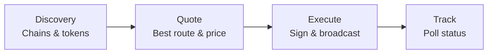

This guide covers the full lifecycle of a cross-chain swap through Hypermid: discovering chains and tokens, getting a quote, executing the swap, and tracking its status.

## Overview
 
A cross-chain swap moves tokens from one blockchain to another in a single user action. Hypermid's smart routing engine evaluates multiple bridge strategies in parallel across **90+ supported blockchains** — including EVM chains, Solana, Bitcoin, XRP, Litecoin, TON, and more — and returns the optimal path automatically.
 
## Swap lifecycle
 
Every swap follows four phases: discover available chains and tokens, get a quote, execute the transaction, and track its status until settlement.
 

 
### 1. Discovery
 
The app fetches all supported chains and tokens from the routing engine. The engine maintains a unified registry across all bridge types, so the user sees one clean token list regardless of which underlying strategy will fulfill the swap.
 
### 2. Quote
 
Hypermid queries its bridge providers simultaneously for the selected token pair. The routing engine compares all returned routes — factoring in output amount, gas cost, and estimated execution time — and surfaces a single best quote. The user never chooses a provider.
 
### 3. Execute
 
The user approves the transaction in their wallet. For EVM chains, this may involve a token approval step followed by the swap transaction itself. The app records a pending swap event via the Hypermid API, which gets updated on completion — no duplicate records.
 
### 4. Track
 
The app polls the status endpoint using the source transaction hash. Status transitions through `PENDING` → `COMPLETED` (or `FAILED`), and the UI reflects progress in real time. Cross-chain settlement ranges from seconds to minutes depending on the bridge strategy used.
 
---
 
## Architecture
 
Hypermid abstracts away bridge complexity behind a single smart routing engine. The user interacts with Hypermid — never with individual bridge providers.
 
<Frame>
  
</Frame>

 
### Bridge strategies
 
| Strategy | Mechanism | Coverage |
| --- | --- | --- |
| **EVM / SOL bridge** | Routes through liquidity pools across EVM-compatible chains and Solana | Ethereum, Polygon, Arbitrum, Optimism, BSC, Avalanche, Base, Solana, and 70+ more |
| **Intent bridge** | Matches counterparties via a solver network for optimal fills | Cross-chain swaps where solver competition yields better pricing |
| **Warp routes** | Direct token transfers via standardised messaging | Extended coverage for chains like PulseChain and other networks outside core bridge support |
 
The routing engine selects the best strategy per swap automatically. In many cases, a single swap may be split across strategies to optimise for price and speed.
 
---

## Step 1: Discover Supported Chains

Fetch the list of supported blockchains to populate your chain selector.

<CodeGroup>
```typescript TypeScript
const chains = await client.getChains();
console.log(chains.data);
// [{ id: 1, name: "Ethereum", type: "EVM", nativeToken: {...} }, ...]
```

```bash cURL
curl https://api.hypermid.io/v1/chains \
  -H "X-API-Key: your-api-key"
```
</CodeGroup>

## Step 2: Discover Tokens

Fetch tokens available on your source and destination chains.

<CodeGroup>
```typescript TypeScript
const tokens = await client.getTokens({
  chains: [1, 42161], // Ethereum and Arbitrum
});

const ethTokens = tokens.data.tokens[1];    // Tokens on Ethereum
const arbTokens = tokens.data.tokens[42161]; // Tokens on Arbitrum
```

```bash cURL
curl "https://api.hypermid.io/v1/tokens?chains=1,42161" \
  -H "X-API-Key: your-api-key"
```
</CodeGroup>

## Step 3: Get a Quote

Request the best swap route for your token pair and amount.

<CodeGroup>
```typescript TypeScript
const quote = await client.getQuote({
  fromChain: 1,                                                  // Ethereum
  toChain: 42161,                                                // Arbitrum
  fromToken: "0x0000000000000000000000000000000000000000",        // ETH
  toToken: "0xaf88d065e77c8cC2239327C5EDb3A432268e5831",          // USDC on Arbitrum
  fromAmount: "1000000000000000000",                              // 1 ETH in wei
  fromAddress: "0xd8dA6BF26964aF9D7eEd9e03E53415D37aA96045",
  slippage: 0.03,                                                 // 3% slippage tolerance
});

if (quote.error) {
  console.error("Quote failed:", quote.error.code, quote.error.message);
  return;
}

console.log("Estimated output:", quote.data.estimate.toAmount);
console.log("Estimated USD value:", quote.data.estimate.toAmountUSD);
console.log("Provider:", quote.data.tool);
console.log("Execution time:", quote.data.estimate.executionDuration, "seconds");
```

```bash cURL
curl -X GET "https://api.hypermid.io/v1/quote?\
fromChain=1&\
toChain=42161&\
fromToken=0x0000000000000000000000000000000000000000&\
toToken=0xaf88d065e77c8cC2239327C5EDb3A432268e5831&\
fromAmount=1000000000000000000&\
fromAddress=0xd8dA6BF26964aF9D7eEd9e03E53415D37aA96045&\
slippage=0.03" \
  -H "X-API-Key: your-api-key"
```
</CodeGroup>

<Tip>
  Set `slippage` to control how much price movement is acceptable. The default is typically 3% (0.03). For stablecoin swaps, consider using 0.5% (0.005).
</Tip>

## Step 4: Execute the Swap

Submit the swap for execution. The response depends on the route type.

<CodeGroup>
```typescript TypeScript
const execution = await client.execute({
  fromChain: 1,
  toChain: 42161,
  fromToken: "0x0000000000000000000000000000000000000000",
  toToken: "0xaf88d065e77c8cC2239327C5EDb3A432268e5831",
  fromAmount: "1000000000000000000",
  fromAddress: "0xd8dA6BF26964aF9D7eEd9e03E53415D37aA96045",
  toAddress: "0xd8dA6BF26964aF9D7eEd9e03E53415D37aA96045",
  slippage: 0.03,
});

if (execution.error) {
  console.error("Execution failed:", execution.error.code);
  return;
}
```

```bash cURL
curl -X POST "https://api.hypermid.io/v1/execute" \
  -H "Content-Type: application/json" \
  -H "X-API-Key: your-api-key" \
  -d '{
    "fromChain": 1,
    "toChain": 42161,
    "fromToken": "0x0000000000000000000000000000000000000000",
    "toToken": "0xaf88d065e77c8cC2239327C5EDb3A432268e5831",
    "fromAmount": "1000000000000000000",
    "fromAddress": "0xd8dA6BF26964aF9D7eEd9e03E53415D37aA96045",
    "toAddress": "0xd8dA6BF26964aF9D7eEd9e03E53415D37aA96045",
    "slippage": 0.03
  }'
```
</CodeGroup>

### Handling the Response

The execution response contains either a `transactionRequest` (wallet mode) or a `depositAddress` (manual deposit mode).

#### Wallet Mode (EVM/Solana)

```typescript
if (execution.data.transactionRequest) {
  const txRequest = execution.data.transactionRequest;

  // Send the transaction using your wallet/signer
  const tx = await wallet.sendTransaction({
    to: txRequest.to,
    data: txRequest.data,
    value: txRequest.value,
    gasLimit: txRequest.gasLimit,
    gasPrice: txRequest.gasPrice,
  });

  console.log("Transaction sent:", tx.hash);

  // Wait for confirmation
  const receipt = await tx.wait();
  console.log("Confirmed in block:", receipt.blockNumber);
}
```

#### Manual Deposit Mode

```typescript
if (execution.data.depositAddress) {
  // For wallet-connected users: use the transactionRequest if available
  if (execution.data.transactionRequest) {
    const tx = await wallet.sendTransaction(execution.data.transactionRequest);
  }

  // For manual deposits: display the deposit address to the user
  console.log("Deposit address:", execution.data.depositAddress);
  console.log("Memo (if required):", execution.data.memo);
  console.log("Deposit ID:", execution.data.depositId);
}
```

## Step 5: Track Status

### Transaction Status

Poll `GET /v1/status` with the transaction hash:

<CodeGroup>
```typescript TypeScript
async function pollStatus(txHash: string, fromChain: number, toChain: number) {
  while (true) {
    const status = await client.getStatus({ txHash, fromChain, toChain });

    console.log("Status:", status.data.status);

    if (status.data.status === "DONE") {
      console.log("Swap complete!");
      console.log("Destination tx:", status.data.receiving?.txHash);
      return status.data;
    }

    if (status.data.status === "FAILED") {
      console.error("Swap failed:", status.data.message);
      throw new Error("Swap failed");
    }

    // Poll every 10 seconds
    await new Promise((resolve) => setTimeout(resolve, 10000));
  }
}
```

```bash cURL
curl "https://api.hypermid.io/v1/status?\
txHash=0xYourTransactionHash&\
fromChain=1&\
toChain=42161" \
  -H "X-API-Key: your-api-key"
```
</CodeGroup>

### Manual Deposit Status

For manual deposit routes, poll `GET /v1/execute/deposit/status` with the deposit ID:

```typescript
const depositStatus = await client.getDepositStatus({
  depositId: execution.data.depositId,
});

console.log("Deposit status:", depositStatus.data.status);
```

## Complete Example

Here's a full working example that handles both route types:

```typescript
import { Hypermid } from "@hypermid/sdk";

const client = new Hypermid({ apiKey: process.env.HYPERMID_API_KEY });

async function swap() {
  // 1. Get a quote
  const quote = await client.getQuote({
    fromChain: 1,
    toChain: 42161,
    fromToken: "0x0000000000000000000000000000000000000000",
    toToken: "0xaf88d065e77c8cC2239327C5EDb3A432268e5831",
    fromAmount: "1000000000000000000",
    fromAddress: "0xYourAddress",
  });

  if (quote.error) {
    throw new Error(`Quote failed: ${quote.error.message}`);
  }

  console.log(`Swapping ${quote.data.estimate.fromAmountUSD} USD`);
  console.log(`Estimated receive: ${quote.data.estimate.toAmountUSD} USD`);

  // 2. Execute the swap
  const exec = await client.execute({
    fromChain: 1,
    toChain: 42161,
    fromToken: "0x0000000000000000000000000000000000000000",
    toToken: "0xaf88d065e77c8cC2239327C5EDb3A432268e5831",
    fromAmount: "1000000000000000000",
    fromAddress: "0xYourAddress",
    toAddress: "0xYourAddress",
  });

  if (exec.error) {
    throw new Error(`Execute failed: ${exec.error.message}`);
  }

  // 3. Handle based on route type
  if (exec.data.transactionRequest) {
    const tx = await wallet.sendTransaction(exec.data.transactionRequest);
    await tx.wait();

    // 4. Poll status
    let status;
    do {
      await new Promise((r) => setTimeout(r, 10000));
      status = await client.getStatus({
        txHash: tx.hash,
        fromChain: 1,
        toChain: 42161,
      });
    } while (status.data.status === "PENDING");

    console.log("Final status:", status.data.status);
  } else if (exec.data.depositAddress) {
    console.log("Send tokens to:", exec.data.depositAddress);
    if (exec.data.memo) console.log("With memo:", exec.data.memo);
  }
}

swap().catch(console.error);
```

## Error Handling

Always handle these common errors:

| Error Code | What to Do |
|------------|------------|
| `NO_ROUTE_FOUND` | Try different token pairs, increase amount, or widen slippage |
| `SLIPPAGE_ERROR` | Increase the `slippage` parameter and retry |
| `RATE_LIMIT` | Back off and retry after `meta.rateLimit.reset` |
| `UPSTREAM_TIMEOUT` | Retry the request after a brief delay |

See the [Error Handling Guide](/guides/error-handling) for comprehensive strategies.
