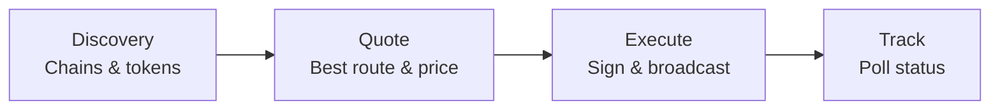

This guide covers the full lifecycle of a cross-chain swap through Hypermid: discovering chains and tokens, getting a quote, executing the swap, and tracking its status.

## Overview
 
A cross-chain swap moves tokens from one blockchain to another in a single user action. Hypermid's smart routing engine evaluates multiple bridge strategies in parallel across **90+ supported blockchains** — including EVM chains, Solana, Bitcoin, XRP, Litecoin, TON, and more — and returns the optimal path automatically.
 
## Swap lifecycle
 
Every swap follows four phases: discover available chains and tokens, get a quote, execute the transaction, and track its status until settlement.
 

 
### 1. Discovery
 
The app fetches all supported chains and tokens from the routing engine. The engine maintains a unified registry across all bridge types, so the user sees one clean token list regardless of which underlying strategy will fulfill the swap.
 
### 2. Quote
 
Hypermid queries its bridge providers simultaneously for the selected token pair. The routing engine compares all returned routes — factoring in output amount, gas cost, and estimated execution time — and surfaces a single best quote. The user never chooses a provider.
 
### 3. Execute
 
The user approves the transaction in their wallet. For EVM chains, this may involve a token approval step followed by the swap transaction itself. The app records a pending swap event via the Hypermid API, which gets updated on completion — no duplicate records.
 
### 4. Track
 
The app polls the status endpoint using the source transaction hash. Status transitions through `PENDING` → `COMPLETED` (or `FAILED`), and the UI reflects progress in real time. Cross-chain settlement ranges from seconds to minutes depending on the bridge strategy used.
 
---
 
## Architecture
 
Hypermid abstracts away bridge complexity behind a single smart routing engine. The user interacts with Hypermid — never with individual bridge providers.
 
```html
<!DOCTYPE html>
<html lang="en">
<head>
<meta charset="UTF-8">
<meta name="viewport" content="width=device-width, initial-scale=1.0">
<title>Hypermid Architecture</title>
<style>
  @import url('https://fonts.googleapis.com/css2?family=Inter:wght@400;500;600;700&display=swap');

  * { margin: 0; padding: 0; box-sizing: border-box; }

  body {
    font-family: 'Inter', sans-serif;
    background: #0a0a1a;
    color: #e0e0f0;
    padding: 48px 24px;
    display: flex;
    flex-direction: column;
    align-items: center;
    gap: 48px;
  }

  .diagram-title {
    font-size: 13px;
    font-weight: 600;
    letter-spacing: 0.08em;
    text-transform: uppercase;
    color: #6c63ff;
    text-align: center;
  }

  /* ── Lifecycle ── */
  .lifecycle {
    display: flex;
    align-items: center;
    gap: 0;
    max-width: 780px;
    width: 100%;
  }

  .phase {
    flex: 1;
    padding: 20px 16px;
    border-radius: 12px;
    border: 1px solid rgba(255,255,255,0.08);
    background: rgba(255,255,255,0.03);
    text-align: center;
    position: relative;
    transition: border-color 0.2s, background 0.2s;
  }
  .phase:hover {
    border-color: rgba(255,255,255,0.15);
    background: rgba(255,255,255,0.05);
  }

  .phase-num {
    font-size: 11px;
    font-weight: 600;
    letter-spacing: 0.06em;
    margin-bottom: 8px;
    opacity: 0.5;
  }
  .phase-name {
    font-size: 15px;
    font-weight: 600;
    margin-bottom: 4px;
  }
  .phase-desc {
    font-size: 12px;
    color: #8888aa;
  }

  .phase:nth-child(1) { border-color: rgba(108,99,255,0.3); }
  .phase:nth-child(1) .phase-name { color: #a29bfe; }
  .phase:nth-child(3) { border-color: rgba(0,210,255,0.3); }
  .phase:nth-child(3) .phase-name { color: #74d7ff; }
  .phase:nth-child(5) { border-color: rgba(124,77,255,0.3); }
  .phase:nth-child(5) .phase-name { color: #b794f6; }
  .phase:nth-child(7) { border-color: rgba(255,107,107,0.3); }
  .phase:nth-child(7) .phase-name { color: #ff8a8a; }

  .arrow-sep {
    flex: 0 0 32px;
    display: flex;
    align-items: center;
    justify-content: center;
    color: #444;
    font-size: 18px;
  }

  /* ── Architecture ── */
  .architecture {
    max-width: 780px;
    width: 100%;
    display: flex;
    flex-direction: column;
    align-items: center;
    gap: 0;
  }

  .user-box {
    padding: 14px 32px;
    border: 1px solid rgba(108,99,255,0.3);
    border-radius: 10px;
    background: rgba(108,99,255,0.06);
    font-size: 14px;
    font-weight: 500;
    color: #c4bfff;
    text-align: center;
  }

  .connector {
    width: 1px;
    height: 32px;
    background: linear-gradient(to bottom, rgba(108,99,255,0.4), rgba(0,210,255,0.4));
    position: relative;
  }
  .connector::after {
    content: '';
    position: absolute;
    bottom: -4px;
    left: -3px;
    width: 0;
    height: 0;
    border-left: 4px solid transparent;
    border-right: 4px solid transparent;
    border-top: 5px solid rgba(0,210,255,0.5);
  }

  .engine-box {
    width: 100%;
    border: 1px solid rgba(0,210,255,0.25);
    border-radius: 16px;
    background: rgba(0,210,255,0.03);
    padding: 24px;
  }

  .engine-label {
    font-size: 14px;
    font-weight: 600;
    color: #74d7ff;
    text-align: center;
    margin-bottom: 20px;
  }

  .bridges {
    display: grid;
    grid-template-columns: repeat(3, 1fr);
    gap: 12px;
  }

  .bridge {
    padding: 16px;
    border-radius: 10px;
    border: 1px solid rgba(255,255,255,0.08);
    background: rgba(255,255,255,0.03);
    text-align: center;
    transition: border-color 0.2s;
  }
  .bridge:hover { border-color: rgba(255,255,255,0.15); }

  .bridge-name {
    font-size: 13px;
    font-weight: 600;
    margin-bottom: 4px;
  }
  .bridge-desc {
    font-size: 11px;
    color: #7777aa;
  }

  .bridge:nth-child(1) { border-color: rgba(124,77,255,0.25); }
  .bridge:nth-child(1) .bridge-name { color: #b794f6; }
  .bridge:nth-child(2) { border-color: rgba(255,107,107,0.25); }
  .bridge:nth-child(2) .bridge-name { color: #ff8a8a; }
  .bridge:nth-child(3) { border-color: rgba(255,167,38,0.25); }
  .bridge:nth-child(3) .bridge-name { color: #ffb74d; }

  .connector2 {
    width: 1px;
    height: 32px;
    background: linear-gradient(to bottom, rgba(0,210,255,0.3), rgba(255,255,255,0.1));
    position: relative;
  }
  .connector2::after {
    content: '';
    position: absolute;
    bottom: -4px;
    left: -3px;
    width: 0;
    height: 0;
    border-left: 4px solid transparent;
    border-right: 4px solid transparent;
    border-top: 5px solid rgba(255,255,255,0.2);
  }

  .chains-box {
    width: 100%;
    border: 1px solid rgba(255,255,255,0.06);
    border-radius: 16px;
    background: rgba(255,255,255,0.02);
    padding: 24px;
    text-align: center;
  }

  .chains-label {
    font-size: 14px;
    font-weight: 600;
    color: #8888aa;
    margin-bottom: 16px;
  }

  .chains-grid {
    display: flex;
    flex-wrap: wrap;
    justify-content: center;
    gap: 8px;
    margin-bottom: 12px;
  }

  .chain-pill {
    display: inline-flex;
    align-items: center;
    gap: 6px;
    padding: 8px 14px;
    border-radius: 8px;
    border: 1px solid rgba(255,255,255,0.08);
    background: rgba(255,255,255,0.04);
    font-size: 13px;
    font-weight: 500;
    transition: border-color 0.2s;
  }
  .chain-pill:hover { border-color: rgba(255,255,255,0.18); }

  .chain-dot {
    width: 8px;
    height: 8px;
    border-radius: 50%;
    flex-shrink: 0;
  }

  .chains-more {
    font-size: 12px;
    color: #555577;
    margin-top: 4px;
  }
</style>
</head>
<body>

<!-- Swap Lifecycle -->
<div>
  <div class="diagram-title" style="margin-bottom: 20px;">Swap lifecycle</div>
  <div class="lifecycle">
    <div class="phase">
      <div class="phase-num">01</div>
      <div class="phase-name">Discovery</div>
      <div class="phase-desc">Chains & tokens</div>
    </div>
    <div class="arrow-sep">→</div>
    <div class="phase">
      <div class="phase-num">02</div>
      <div class="phase-name">Quote</div>
      <div class="phase-desc">Best route & price</div>
    </div>
    <div class="arrow-sep">→</div>
    <div class="phase">
      <div class="phase-num">03</div>
      <div class="phase-name">Execute</div>
      <div class="phase-desc">Sign & broadcast</div>
    </div>
    <div class="arrow-sep">→</div>
    <div class="phase">
      <div class="phase-num">04</div>
      <div class="phase-name">Track</div>
      <div class="phase-desc">Poll status</div>
    </div>
  </div>
</div>

<!-- Architecture -->
<div>
  <div class="diagram-title" style="margin-bottom: 20px;">Architecture</div>
  <div class="architecture">
    <div class="user-box">User / dApp / Swap Widget</div>
    <div class="connector"></div>

    <div class="engine-box">
      <div class="engine-label">⚡ Hypermid Smart Routing Engine</div>
      <div class="bridges">
        <div class="bridge">
          <div class="bridge-name">EVM / SOL Bridge</div>
          <div class="bridge-desc">Liquidity pools</div>
        </div>
        <div class="bridge">
          <div class="bridge-name">Intent Bridge</div>
          <div class="bridge-desc">Solver network</div>
        </div>
        <div class="bridge">
          <div class="bridge-name">Warp Routes</div>
          <div class="bridge-desc">Cross-chain transfers</div>
        </div>
      </div>
    </div>

    <div class="connector2"></div>

    <div class="chains-box">
      <div class="chains-label">90+ Supported Blockchains</div>
      <div class="chains-grid">
        <div class="chain-pill"><span class="chain-dot" style="background:#627eea"></span>Ethereum</div>
        <div class="chain-pill"><span class="chain-dot" style="background:#14f195"></span>Solana</div>
        <div class="chain-pill"><span class="chain-dot" style="background:#f7931a"></span>Bitcoin</div>
        <div class="chain-pill"><span class="chain-dot" style="background:#00aae4"></span>XRP</div>
        <div class="chain-pill"><span class="chain-dot" style="background:#bfbbbb"></span>Litecoin</div>
        <div class="chain-pill"><span class="chain-dot" style="background:#0098ea"></span>TON</div>
        <div class="chain-pill"><span class="chain-dot" style="background:#28a0f0"></span>Arbitrum</div>
        <div class="chain-pill"><span class="chain-dot" style="background:#0052ff"></span>Base</div>
        <div class="chain-pill"><span class="chain-dot" style="background:#8247e5"></span>Polygon</div>
        <div class="chain-pill"><span class="chain-dot" style="background:#ff0420"></span>Optimism</div>
        <div class="chain-pill"><span class="chain-dot" style="background:#f0b90b"></span>BSC</div>
        <div class="chain-pill"><span class="chain-dot" style="background:#e84142"></span>Avalanche</div>
      </div>
      <div class="chains-more">+ PulseChain, Fantom, Gnosis, zkSync, Linea, Scroll, Mantle, and 75+ more</div>
    </div>
  </div>
</div>

</body>
</html>
```
 
### Bridge strategies
 
| Strategy | Mechanism | Coverage |
| --- | --- | --- |
| **EVM / SOL bridge** | Routes through liquidity pools across EVM-compatible chains and Solana | Ethereum, Polygon, Arbitrum, Optimism, BSC, Avalanche, Base, Solana, and 70+ more |
| **Intent bridge** | Matches counterparties via a solver network for optimal fills | Cross-chain swaps where solver competition yields better pricing |
| **Warp routes** | Direct token transfers via standardised messaging | Extended coverage for chains like PulseChain and other networks outside core bridge support |
 
The routing engine selects the best strategy per swap automatically. In many cases, a single swap may be split across strategies to optimise for price and speed.
 
---

## Step 1: Discover Supported Chains

Fetch the list of supported blockchains to populate your chain selector.

<CodeGroup>
```typescript TypeScript
const chains = await client.getChains();
console.log(chains.data);
// [{ id: 1, name: "Ethereum", type: "EVM", nativeToken: {...} }, ...]
```

```bash cURL
curl https://api.hypermid.io/v1/chains \
  -H "X-API-Key: your-api-key"
```
</CodeGroup>

## Step 2: Discover Tokens

Fetch tokens available on your source and destination chains.

<CodeGroup>
```typescript TypeScript
const tokens = await client.getTokens({
  chains: [1, 42161], // Ethereum and Arbitrum
});

const ethTokens = tokens.data.tokens[1];    // Tokens on Ethereum
const arbTokens = tokens.data.tokens[42161]; // Tokens on Arbitrum
```

```bash cURL
curl "https://api.hypermid.io/v1/tokens?chains=1,42161" \
  -H "X-API-Key: your-api-key"
```
</CodeGroup>

## Step 3: Get a Quote

Request the best swap route for your token pair and amount.

<CodeGroup>
```typescript TypeScript
const quote = await client.getQuote({
  fromChain: 1,                                                  // Ethereum
  toChain: 42161,                                                // Arbitrum
  fromToken: "0x0000000000000000000000000000000000000000",        // ETH
  toToken: "0xaf88d065e77c8cC2239327C5EDb3A432268e5831",          // USDC on Arbitrum
  fromAmount: "1000000000000000000",                              // 1 ETH in wei
  fromAddress: "0xd8dA6BF26964aF9D7eEd9e03E53415D37aA96045",
  slippage: 0.03,                                                 // 3% slippage tolerance
});

if (quote.error) {
  console.error("Quote failed:", quote.error.code, quote.error.message);
  return;
}

console.log("Estimated output:", quote.data.estimate.toAmount);
console.log("Estimated USD value:", quote.data.estimate.toAmountUSD);
console.log("Provider:", quote.data.tool);
console.log("Execution time:", quote.data.estimate.executionDuration, "seconds");
```

```bash cURL
curl -X GET "https://api.hypermid.io/v1/quote?\
fromChain=1&\
toChain=42161&\
fromToken=0x0000000000000000000000000000000000000000&\
toToken=0xaf88d065e77c8cC2239327C5EDb3A432268e5831&\
fromAmount=1000000000000000000&\
fromAddress=0xd8dA6BF26964aF9D7eEd9e03E53415D37aA96045&\
slippage=0.03" \
  -H "X-API-Key: your-api-key"
```
</CodeGroup>

<Tip>
  Set `slippage` to control how much price movement is acceptable. The default is typically 3% (0.03). For stablecoin swaps, consider using 0.5% (0.005).
</Tip>

## Step 4: Execute the Swap

Submit the swap for execution. The response depends on the route type.

<CodeGroup>
```typescript TypeScript
const execution = await client.execute({
  fromChain: 1,
  toChain: 42161,
  fromToken: "0x0000000000000000000000000000000000000000",
  toToken: "0xaf88d065e77c8cC2239327C5EDb3A432268e5831",
  fromAmount: "1000000000000000000",
  fromAddress: "0xd8dA6BF26964aF9D7eEd9e03E53415D37aA96045",
  toAddress: "0xd8dA6BF26964aF9D7eEd9e03E53415D37aA96045",
  slippage: 0.03,
});

if (execution.error) {
  console.error("Execution failed:", execution.error.code);
  return;
}
```

```bash cURL
curl -X POST "https://api.hypermid.io/v1/execute" \
  -H "Content-Type: application/json" \
  -H "X-API-Key: your-api-key" \
  -d '{
    "fromChain": 1,
    "toChain": 42161,
    "fromToken": "0x0000000000000000000000000000000000000000",
    "toToken": "0xaf88d065e77c8cC2239327C5EDb3A432268e5831",
    "fromAmount": "1000000000000000000",
    "fromAddress": "0xd8dA6BF26964aF9D7eEd9e03E53415D37aA96045",
    "toAddress": "0xd8dA6BF26964aF9D7eEd9e03E53415D37aA96045",
    "slippage": 0.03
  }'
```
</CodeGroup>

### Handling the Response

The execution response contains either a `transactionRequest` (LI.FI routes) or a `depositAddress` (Near Intents routes).

#### LI.FI Routes (EVM/Solana)

```typescript
if (execution.data.transactionRequest) {
  const txRequest = execution.data.transactionRequest;

  // Send the transaction using your wallet/signer
  const tx = await wallet.sendTransaction({
    to: txRequest.to,
    data: txRequest.data,
    value: txRequest.value,
    gasLimit: txRequest.gasLimit,
    gasPrice: txRequest.gasPrice,
  });

  console.log("Transaction sent:", tx.hash);

  // Wait for confirmation
  const receipt = await tx.wait();
  console.log("Confirmed in block:", receipt.blockNumber);
}
```

#### Near Intents Routes

```typescript
if (execution.data.depositAddress) {
  // For wallet-connected users: use the transactionRequest if available
  if (execution.data.transactionRequest) {
    const tx = await wallet.sendTransaction(execution.data.transactionRequest);
  }

  // For manual deposits: display the deposit address to the user
  console.log("Deposit address:", execution.data.depositAddress);
  console.log("Memo (if required):", execution.data.memo);
  console.log("Deposit ID:", execution.data.depositId);
}
```

## Step 5: Track Status

### LI.FI Route Status

Poll `GET /v1/status` with the transaction hash:

<CodeGroup>
```typescript TypeScript
async function pollStatus(txHash: string, fromChain: number, toChain: number) {
  while (true) {
    const status = await client.getStatus({ txHash, fromChain, toChain });

    console.log("Status:", status.data.status);

    if (status.data.status === "DONE") {
      console.log("Swap complete!");
      console.log("Destination tx:", status.data.receiving?.txHash);
      return status.data;
    }

    if (status.data.status === "FAILED") {
      console.error("Swap failed:", status.data.message);
      throw new Error("Swap failed");
    }

    // Poll every 10 seconds
    await new Promise((resolve) => setTimeout(resolve, 10000));
  }
}
```

```bash cURL
curl "https://api.hypermid.io/v1/status?\
txHash=0xYourTransactionHash&\
fromChain=1&\
toChain=42161" \
  -H "X-API-Key: your-api-key"
```
</CodeGroup>

### Near Intents Deposit Status

Poll `GET /v1/execute/deposit/status` with the deposit ID:

```typescript
const depositStatus = await client.getDepositStatus({
  depositId: execution.data.depositId,
});

console.log("Deposit status:", depositStatus.data.status);
```

## Complete Example

Here's a full working example that handles both route types:

```typescript
import { Hypermid } from "@hypermid/sdk";

const client = new Hypermid({ apiKey: process.env.HYPERMID_API_KEY });

async function swap() {
  // 1. Get a quote
  const quote = await client.getQuote({
    fromChain: 1,
    toChain: 42161,
    fromToken: "0x0000000000000000000000000000000000000000",
    toToken: "0xaf88d065e77c8cC2239327C5EDb3A432268e5831",
    fromAmount: "1000000000000000000",
    fromAddress: "0xYourAddress",
  });

  if (quote.error) {
    throw new Error(`Quote failed: ${quote.error.message}`);
  }

  console.log(`Swapping ${quote.data.estimate.fromAmountUSD} USD`);
  console.log(`Estimated receive: ${quote.data.estimate.toAmountUSD} USD`);

  // 2. Execute the swap
  const exec = await client.execute({
    fromChain: 1,
    toChain: 42161,
    fromToken: "0x0000000000000000000000000000000000000000",
    toToken: "0xaf88d065e77c8cC2239327C5EDb3A432268e5831",
    fromAmount: "1000000000000000000",
    fromAddress: "0xYourAddress",
    toAddress: "0xYourAddress",
  });

  if (exec.error) {
    throw new Error(`Execute failed: ${exec.error.message}`);
  }

  // 3. Handle based on route type
  if (exec.data.transactionRequest) {
    const tx = await wallet.sendTransaction(exec.data.transactionRequest);
    await tx.wait();

    // 4. Poll status
    let status;
    do {
      await new Promise((r) => setTimeout(r, 10000));
      status = await client.getStatus({
        txHash: tx.hash,
        fromChain: 1,
        toChain: 42161,
      });
    } while (status.data.status === "PENDING");

    console.log("Final status:", status.data.status);
  } else if (exec.data.depositAddress) {
    console.log("Send tokens to:", exec.data.depositAddress);
    if (exec.data.memo) console.log("With memo:", exec.data.memo);
  }
}

swap().catch(console.error);
```

## Error Handling

Always handle these common errors:

| Error Code | What to Do |
|------------|------------|
| `NO_ROUTE_FOUND` | Try different token pairs, increase amount, or widen slippage |
| `SLIPPAGE_ERROR` | Increase the `slippage` parameter and retry |
| `RATE_LIMIT` | Back off and retry after `meta.rateLimit.reset` |
| `UPSTREAM_TIMEOUT` | Retry the request after a brief delay |

See the [Error Handling Guide](/guides/error-handling) for comprehensive strategies.
