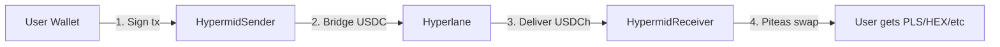

# SuperSwap Integration Guide

SuperSwap enables cross-chain swaps between **PulseChain** and any supported blockchain. It uses [Hyperlane](https://hyperlane.xyz) Warp Routes for bridging and [Piteas](https://piteas.io) DEX for on-chain swaps on PulseChain.

## How It Works

SuperSwap integrates seamlessly into the existing Hypermid API. When a swap involves PulseChain (chain ID `369`), the API automatically routes through SuperSwap — no additional configuration needed.



## Supported Directions

| Direction | Example | User Signatures |
|-----------|---------|-----------------|
| **Inbound Direct** | USDC on Base → PLS | 1 transaction |
| **Inbound Multi-step** | ETH on Base → PLS | 1 transaction + 1 EIP-712 sign |
| **Outbound Direct** | PLS → USDC on Base | 1 transaction |
| **Outbound Multi-step** | PLS → ETH on Base | 1 transaction |

## Quick Start

### 1. Get a Quote

Use the standard [`GET /v1/quote`](/api-reference/quote) endpoint. The API detects PulseChain and routes through SuperSwap automatically.

<CodeGroup>
```bash Direct Inbound (USDC → PLS)
curl "https://api.hypermid.io/v1/quote?\
fromChain=8453&\
toChain=369&\
fromToken=0x833589fCD6eDb6E08f4c7C32D4f71b54bdA02913&\
toToken=0xA1077a294dDE1B09bB078844df40758a5D0f9a27&\
fromAmount=5000000&\
fromAddress=0xYourWallet&\
slippage=0.03" \
  -H "X-API-Key: your-api-key"
```

```bash Multi-step Inbound (ETH → PLS)
curl "https://api.hypermid.io/v1/quote?\
fromChain=8453&\
toChain=369&\
fromToken=0x0000000000000000000000000000000000000000&\
toToken=0xA1077a294dDE1B09bB078844df40758a5D0f9a27&\
fromAmount=1000000000000000&\
fromAddress=0xYourWallet&\
slippage=0.03" \
  -H "X-API-Key: your-api-key"
```

```bash Direct Outbound (PLS → USDC)
curl "https://api.hypermid.io/v1/quote?\
fromChain=369&\
toChain=8453&\
fromToken=0xA1077a294dDE1B09bB078844df40758a5D0f9a27&\
toToken=0x833589fCD6eDb6E08f4c7C32D4f71b54bdA02913&\
fromAmount=200000000000000000000000&\
fromAddress=0xYourWallet&\
slippage=50" \
  -H "X-API-Key: your-api-key"
```
</CodeGroup>

### 2. Execute the Transaction

For **direct** quotes, sign and broadcast the `transactionRequest` from the response using the user's wallet.

For **multi-step inbound** quotes (where `singleSignature: true`):

```typescript
import { createWalletClient, custom } from 'viem';
import { base } from 'viem/chains';

const walletClient = createWalletClient({
  chain: base,
  transport: custom(window.ethereum),
});

// Step 1: Sign and broadcast the LiFi swap
const txHash = await walletClient.sendTransaction(quote.steps[0].transactionRequest);

// Wait for confirmation
await publicClient.waitForTransactionReceipt({ hash: txHash });

// Step 2: Sign the EIP-712 message (gasless — no tx cost)
const { afterStep1 } = quote;
const signature = await walletClient.signTypedData({
  domain: afterStep1.eip712.domain,
  types: afterStep1.eip712.types,
  primaryType: afterStep1.eip712.primaryType,
  message: {
    ...afterStep1.eip712.message,
    txHash,  // Fill in the actual tx hash
  },
});

// Step 3: Register the deposit
const response = await fetch("https://api.hypermid.io/v1/inbound-receiver/register", {
  method: "POST",
  headers: { "Content-Type": "application/json" },
  body: JSON.stringify({
    ...afterStep1.body,
    txHash,
    signature,
  }),
});

// Done! Backend handles bridge + swap automatically (~5 min)
```

### 3. Check Status

```bash
curl "https://api.hypermid.io/v1/status?\
txHash=0xYourTxHash&\
fromChain=8453&\
toChain=369&\
provider=superswap" \
  -H "X-API-Key: your-api-key"
```

## Fee Structure

| Fee | Amount | Description |
|-----|--------|-------------|
| Protocol fee | 0.3% | Deducted on-chain from the bridged amount (max 1%) |
| Bridge gas | ~$0.01 PLS | Hyperlane cross-chain gas (included in tx value) |
| Destination gas | Sponsored | PulseChain executor gas is sponsored by Hypermid |

## SuperSwap Status Values

| Status | SubStatus | Description |
|--------|-----------|-------------|
| `PENDING` | `WAIT_SOURCE_CONFIRMATIONS` | Transaction submitted |
| `PENDING` | `BRIDGE_IN_PROGRESS` | Hyperlane bridge in transit (~3-5 min) |
| `PENDING` | `SWAP_IN_PROGRESS` | Piteas swap executing on PulseChain |
| `DONE` | `COMPLETED` | Output tokens delivered to user |
| `DONE` | `FALLBACK_SENT` | Swap failed — USDCh returned to user |
| `FAILED` | `BRIDGE_TIMEOUT` | Bridge did not complete within 30 min |

## Execution Time

| Route | Estimated Time |
|-------|---------------|
| Direct inbound/outbound | ~3-5 minutes |
| Multi-step inbound/outbound | ~5-7 minutes |

If the Piteas swap fails after 3 retries, USDCh is returned to the user automatically as a fallback.

## PulseChain Tokens

| Token | Symbol | Address | Decimals |
|-------|--------|---------|----------|
| Wrapped PLS | WPLS | `0xA1077a294dDE1B09bB078844df40758a5D0f9a27` | 18 |
| USDCh | USDCh | `0xa5B0D537CeBE97f087Dc5FE5732d70719caaEc1D` | 6 |
| HEX | HEX | `0x2b591e99afE9f32eAA6214f7B7629768c40Eeb39` | 8 |
| PulseX | PLSX | `0x95B303987A60C71504D99Aa1b13B4DA07b0790ab` | 18 |

<Note>
  Use the **WPLS address** (`0xA1077a...`) when requesting PLS output — not the zero address or "PLS" string. The API normalizes automatically, but using WPLS directly avoids ambiguity.
</Note>

## Contracts

| Contract | Chain | Address |
|----------|-------|---------|
| HypermidSender v2 | Base | `0xAd96Fb4bEe3ca08Fb481B554f1819CCb1388CF79` |
| HypermidSender v2 | ETH/ARB/POLY/OP/UNI | `0xF481bcc17f14a5F37dB274e537b6dddfC98B0559` |
| HypermidReceiver v3 | PulseChain | `0x55f8C0Ed4394aEdc241BcbC569be28A2887A9D04` |
| InboundReceiver | Base | `0xd6e9D744643951bd4Cea0f153a78E9cc87B66Fef` |
| OutboundSender | PulseChain | `0x49FacDAF4140efa18768cd5c40696e4602a57EA5` |
| OutboundReceiver v3 | Base | `0xfD11e81dEC82aac69B6AF90F80De44EF2Ab76c89` |
