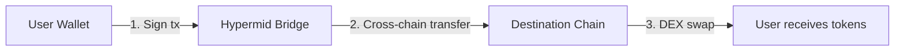

# SuperSwap Integration Guide

SuperSwap enables cross-chain swaps between any supported blockchain. It integrates seamlessly into the Hypermid API — when a swap involves a SuperSwap-supported chain, the API automatically selects the optimal route.



## Supported Chains

| Chain | Chain ID | Direction | Status |
|-------|----------|-----------|--------|
| Ethereum | 1 | Inbound & Outbound | Active |
| Base | 8453 | Inbound & Outbound | Active |
| Arbitrum | 42161 | Inbound & Outbound | Active |
| Polygon | 137 | Inbound & Outbound | Active |
| Optimism | 10 | Inbound & Outbound | Active |
| Unichain | 130 | Inbound & Outbound | Active |
| PulseChain | 369 | Inbound & Outbound | Active |
| Solana | — | Inbound | Coming Soon |
| Bitcoin | — | Inbound | Coming Soon |

## Supported Directions

| Direction | Example | User Signatures |
|-----------|---------|-----------------|
| **Direct** | USDC on Base → PLS on PulseChain | 1 transaction |
| **Multi-step** | ETH on Base → PLS on PulseChain | 1 transaction + 1 EIP-712 sign |
| **Outbound Direct** | PLS → USDC on Base | 1 transaction |
| **Outbound Multi-step** | PLS → ETH on Base | 1 transaction |

## Quick Start

### 1. Get a Quote

Use the standard [`GET /v1/quote`](/api-reference/quote) endpoint. The API detects SuperSwap routes automatically.

<CodeGroup>
```bash Direct Swap (USDC → PLS)
curl "https://api.hypermid.io/v1/quote?\
fromChain=8453&\
toChain=369&\
fromToken=0x833589fCD6eDb6E08f4c7C32D4f71b54bdA02913&\
toToken=0xA1077a294dDE1B09bB078844df40758a5D0f9a27&\
fromAmount=5000000&\
fromAddress=0xYourWallet&\
slippage=0.03" \
  -H "X-API-Key: your-api-key"
```

```bash Multi-step Swap (ETH → PLS)
curl "https://api.hypermid.io/v1/quote?\
fromChain=8453&\
toChain=369&\
fromToken=0x0000000000000000000000000000000000000000&\
toToken=0xA1077a294dDE1B09bB078844df40758a5D0f9a27&\
fromAmount=1000000000000000&\
fromAddress=0xYourWallet&\
slippage=0.03" \
  -H "X-API-Key: your-api-key"
```

```bash Outbound Swap (PLS → USDC)
curl "https://api.hypermid.io/v1/quote?\
fromChain=369&\
toChain=8453&\
fromToken=0xA1077a294dDE1B09bB078844df40758a5D0f9a27&\
toToken=0x833589fCD6eDb6E08f4c7C32D4f71b54bdA02913&\
fromAmount=200000000000000000000000&\
fromAddress=0xYourWallet&\
slippage=50" \
  -H "X-API-Key: your-api-key"
```
</CodeGroup>

### 2. Execute the Transaction

For **direct** quotes, sign and broadcast the `transactionRequest` from the response.

For **multi-step** quotes (where `singleSignature: true`):

```typescript
import { createWalletClient, custom } from 'viem';
import { base } from 'viem/chains';

const walletClient = createWalletClient({
  chain: base,
  transport: custom(window.ethereum),
});

// Step 1: Sign and broadcast the swap transaction
const txHash = await walletClient.sendTransaction(
  quote.steps[0].transactionRequest
);

// Wait for confirmation
await publicClient.waitForTransactionReceipt({ hash: txHash });

// Step 2: Authorize the deposit routing (gasless wallet signature)
const { afterStep1 } = quote;
const signature = await walletClient.signTypedData({
  domain: afterStep1.eip712.domain,
  types: afterStep1.eip712.types,
  primaryType: afterStep1.eip712.primaryType,
  message: {
    ...afterStep1.eip712.message,
    txHash,  // Fill in the actual tx hash
  },
});

// Step 3: Confirm the deposit
await fetch("https://api.hypermid.io/v1/inbound-receiver/register", {
  method: "POST",
  headers: { "Content-Type": "application/json" },
  body: JSON.stringify({
    ...afterStep1.body,
    txHash,
    signature,
  }),
});

// Done! Hypermid handles the rest automatically (~5 min)
```

### 3. Check Status

```bash
curl "https://api.hypermid.io/v1/status?\
txHash=0xYourTxHash&\
fromChain=8453&\
toChain=369&\
provider=superswap" \
  -H "X-API-Key: your-api-key"
```

## Pricing

SuperSwap quotes include all fees, gas costs, and price impact in the estimated output amount. There are no hidden fees — what you see in the quote is what you get.

The `estimate.toAmount` in the quote response is the final amount the user receives after all costs.

## Status Values

| Status | SubStatus | Description |
|--------|-----------|-------------|
| `PENDING` | `WAIT_SOURCE_CONFIRMATIONS` | Transaction submitted |
| `PENDING` | `BRIDGE_IN_PROGRESS` | Cross-chain transfer in progress (~3-5 min) |
| `PENDING` | `SWAP_IN_PROGRESS` | DEX swap executing on destination chain |
| `DONE` | `COMPLETED` | Output tokens delivered to user |
| `DONE` | `FALLBACK_SENT` | Swap unavailable — stablecoin returned to user |
| `FAILED` | `BRIDGE_TIMEOUT` | Bridge did not complete within timeout |

## Execution Time

| Route | Estimated Time |
|-------|---------------|
| Direct swap | ~3-5 minutes |
| Multi-step swap | ~5-7 minutes |

If the destination swap is unavailable after 3 retries, the bridged stablecoin is returned to the user automatically as a fallback.

## Supported Tokens

SuperSwap supports all major tokens on connected chains. Here are the most popular PulseChain tokens:

| Token | Symbol | Decimals |
|-------|--------|----------|
| PulseChain | PLS | 18 |
| HEX | HEX | 8 |
| PulseX | PLSX | 18 |
| Incentive | INC | 18 |
| Hedron | HDRN | 9 |
| LOAN | LOAN | 18 |
| Tether USD | USDT | 6 |
| Dai | DAI | 18 |
| Wrapped Bitcoin | WBTC | 8 |
| Ethereum | ETH | 18 |

<Note>
When swapping to PLS (the native token), you can use either the zero address or the WPLS address (`0xA1077a294dDE1B09bB078844df40758a5D0f9a27`). The API handles the conversion automatically.
</Note>
